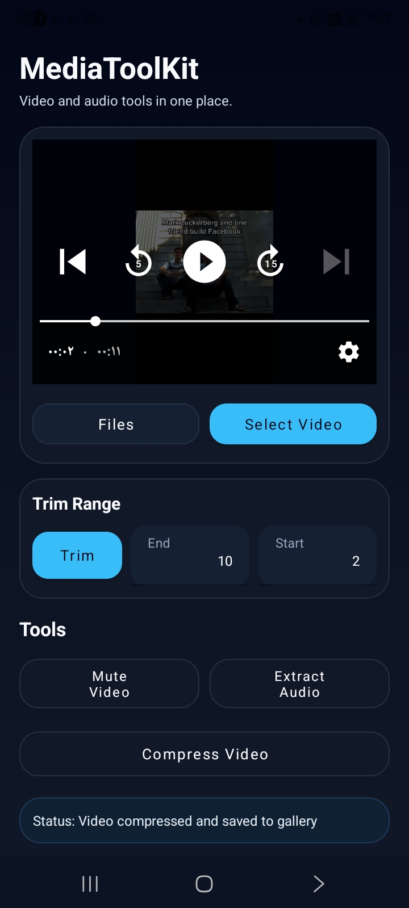
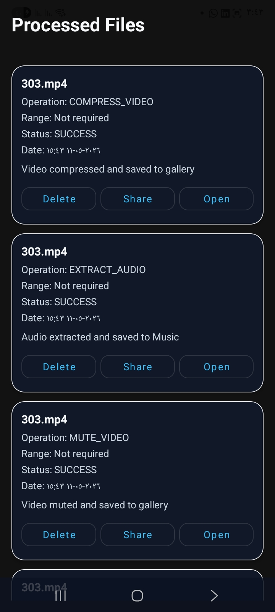

# MediaToolKitApp

**MediaToolKitApp** is an Android media processing application built with Kotlin.  
It allows users to select a video, preview it, process it using FFmpeg, and manage the generated output files.

The project was built as a practical Android portfolio project to demonstrate media handling, background processing, local storage, clean UI state management, and file management.

---

## Features

- Select video files from device storage
- Preview selected videos using ExoPlayer
- Trim videos by start and end seconds
- Extract audio from video
- Mute video by removing the audio track
- Compress video with progress tracking
- Save processed videos to Gallery
- Save extracted audio to Music
- Track processing operations locally
- View processed files history
- Open processed files
- Share processed files
- Delete processed files
- Clean UI built with XML and Material Design

---

## Screenshots

<p align="center">
  
  &nbsp;&nbsp;&nbsp;&nbsp;&nbsp;&nbsp;&nbsp;&nbsp;&nbsp;&nbsp;&nbsp;&nbsp;&nbsp;&nbsp;&nbsp;&nbsp;&nbsp;&nbsp;&nbsp;&nbsp;&nbsp;&nbsp;&nbsp;&nbsp;&nbsp;&nbsp;&nbsp;&nbsp;&nbsp;&nbsp;&nbsp;&nbsp;&nbsp;&nbsp;&nbsp;&nbsp;&nbsp;&nbsp;&nbsp;&nbsp;
  
</p>

<p align="center">
  <b>Main Screen</b>
  &nbsp;&nbsp;&nbsp;&nbsp;&nbsp;&nbsp;&nbsp;&nbsp;&nbsp;&nbsp;&nbsp;&nbsp;&nbsp;&nbsp;&nbsp;&nbsp;&nbsp;&nbsp;&nbsp;&nbsp;&nbsp;&nbsp;&nbsp;&nbsp;&nbsp;&nbsp;&nbsp;&nbsp;&nbsp;&nbsp;&nbsp;&nbsp;&nbsp;&nbsp;&nbsp;&nbsp;&nbsp;&nbsp;&nbsp;&nbsp;&nbsp;&nbsp;&nbsp;&nbsp;&nbsp;&nbsp;&nbsp;&nbsp;&nbsp;&nbsp;&nbsp;&nbsp;&nbsp;&nbsp;&nbsp;&nbsp;
  <b>Processed Files Screen</b>
</p>

---

## Tech Stack

- Kotlin
- XML Views
- MVVM Architecture
- ViewModel
- StateFlow
- Coroutines
- Room Database
- Repository Pattern
- ExoPlayer / Media3
- FFmpeg Kit
- MediaStore API
- Material Design Components
- RecyclerView
- ConstraintLayout

---

## Architecture

The project follows a simple MVVM-based structure:

```text
UI Layer
├── MainActivity
├── ProcessedFilesActivity
├── XML Layouts
└── RecyclerView Adapter

Presentation Layer
├── MediaViewModel
└── MediaUiState

Media Processing Layer
└── MediaProcessor

Data Layer
├── MediaRepository
├── MediaRepositoryImpl
├── MediaHistoryDao
├── AppDatabase
└── MediaHistoryEntity

Utility Layer
└── MediaFileManager
```

---

## How It Works

1. The user selects a video from the device.
2. The selected video URI is copied to the app cache.
3. The video is previewed using ExoPlayer.
4. The user chooses one of the available tools:
   - Trim Video
   - Extract Audio
   - Mute Video
   - Compress Video
5. FFmpeg processes the file in the background.
6. The processed output is saved using MediaStore.
7. The operation result is stored locally using Room Database.
8. The user can view, open, share, or delete processed files.

---

## Main FFmpeg Operations

### Trim Video

```bash
-y -ss START_SECONDS -i input.mp4 -t DURATION -c copy output.mp4
```

This command cuts a specific part of the video without re-encoding.

### Extract Audio

```bash
-y -i input.mp4 -vn -c:a aac -b:a 128k output.m4a
```

This command removes the video stream and saves only the audio.

### Mute Video

```bash
-y -i input.mp4 -an -c:v copy output.mp4
```

This command removes the audio stream while keeping the video stream.

### Compress Video

```bash
-y -i input.mp4 -c:v mpeg4 -q:v 7 -c:a aac -b:a 96k output.mp4
```

This command compresses the video and reduces the output file size.

---

## Main Components

### MainActivity

Responsible for:

- Displaying the main screen
- Handling video selection
- Playing video preview using ExoPlayer
- Observing UI state from the ViewModel
- Triggering media processing actions

### MediaViewModel

Responsible for:

- Managing UI state
- Handling selected video data
- Calling media processing functions
- Saving processing history
- Updating progress state during compression

### MediaProcessor

Responsible for executing FFmpeg commands:

- Trim video
- Extract audio
- Mute video
- Compress video

### MediaFileManager

Responsible for file handling:

- Copying selected URI files to cache
- Creating temporary output files
- Saving videos to Gallery
- Saving audio files to Music
- Deleting processed files by URI
- Reading video duration for progress calculation

---

## Room Database

Room is used to store processing history locally.

Each history item includes:

- Operation type
- Input file name
- Input path
- Output path
- Output MIME type
- Start and end seconds when needed
- Operation status
- Message
- Creation date

---

## Processing History

Supported operation statuses:

```text
SUCCESS
FAILED
```

Supported operation types:

```text
TRIM_VIDEO
EXTRACT_AUDIO
MUTE_VIDEO
COMPRESS_VIDEO
```

---

## Processed Files Screen

The processed files screen displays successful output files only.

Users can:

- Open output files
- Share output files
- Delete output files

---

## Why This Project?

This project demonstrates practical Android development skills, including:

- Working with media files
- Handling Android storage using MediaStore
- Processing videos and audio using FFmpeg
- Managing background operations with Coroutines
- Updating UI state using StateFlow
- Saving local data with Room
- Building a clean Android app structure with MVVM

---

## Future Improvements

- Add video format conversion
- Add video-to-GIF conversion
- Add frame extraction from video
- Add file rename before saving
- Add progress tracking for all operations
- Add file size comparison before and after compression
- Add dark/light theme switch
- Add better error handling and user messages
- Add unit tests for ViewModel and Repository

---

## Project Goal

The goal of MediaToolKitApp is to provide a small but practical Android media toolkit while demonstrating clean Android architecture and real-world file processing.

---

## Author

**Ibrahim Awad**  
Android Developer

---

## License

This project is for learning and portfolio purposes.